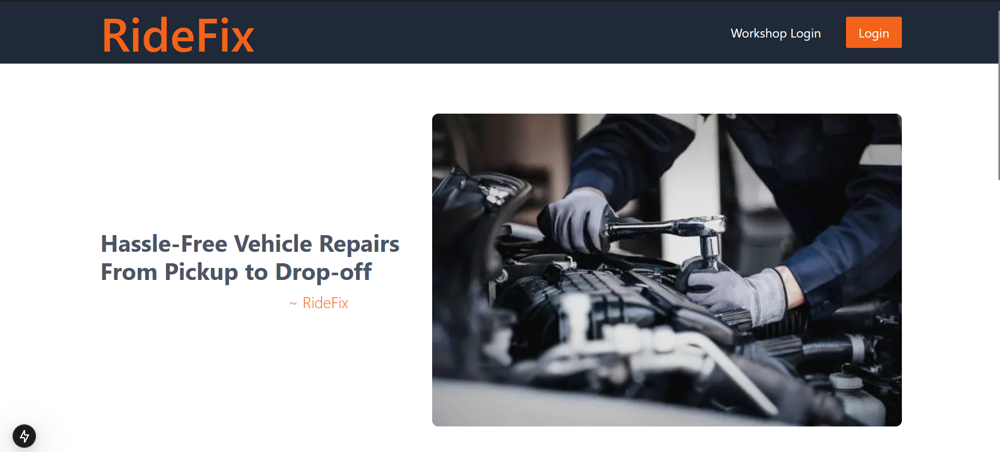

🚗 RideFix - Vehicle Repair Request & Workshop Management Platform

RideFix is a full-stack web application that connects vehicle owners with verified repair workshops. It simplifies the process of requesting repairs, managing repair logs, tracking real-time repair progress, securely storing related Data and make secure payments through Khalti integration.
🔧 Key Features

    🧾 Submit and manage vehicle repair requests

    🛠 Workshops can accept, process, and update repair logs

    🔐 Secure Data Storage

    📡 Real-time status tracking for ongoing repairs

    💬 Communication interface between users and workshops

    💳 Secure Payments with Khalti – Seamless and secure digital payments integrated via the Khalti API.

🛠 Tech Stack

    Frontend: Next.js, Zustand (for global state management), Tailwind CSS

    Backend: Node.js, Express.js, MongoDB

    Security: bcrypt for  password-hashing

📦 Modules

    User Panel

    Workshop Dashboard

📸 ScreenShots

    
    

